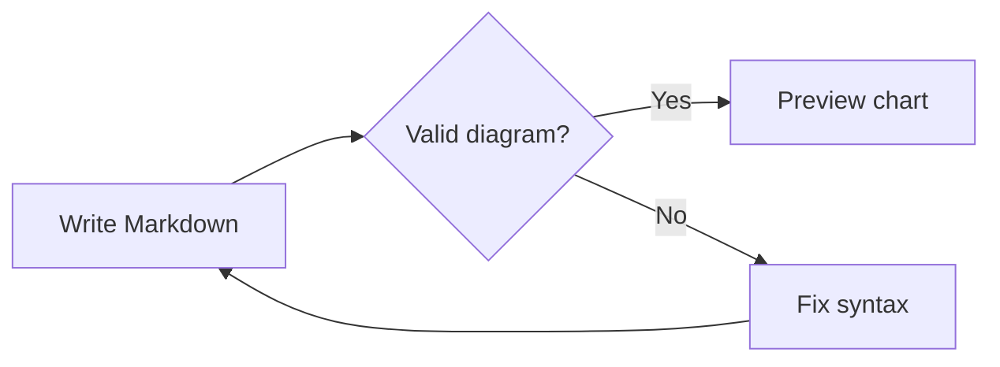
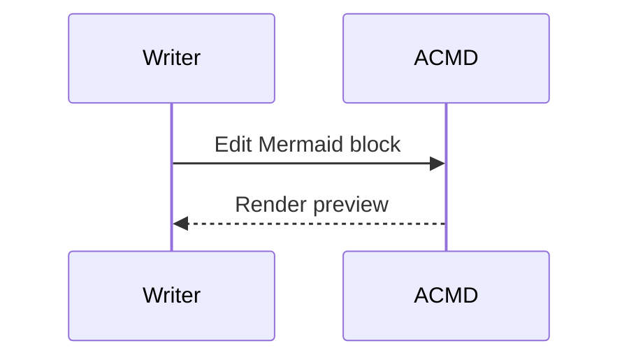
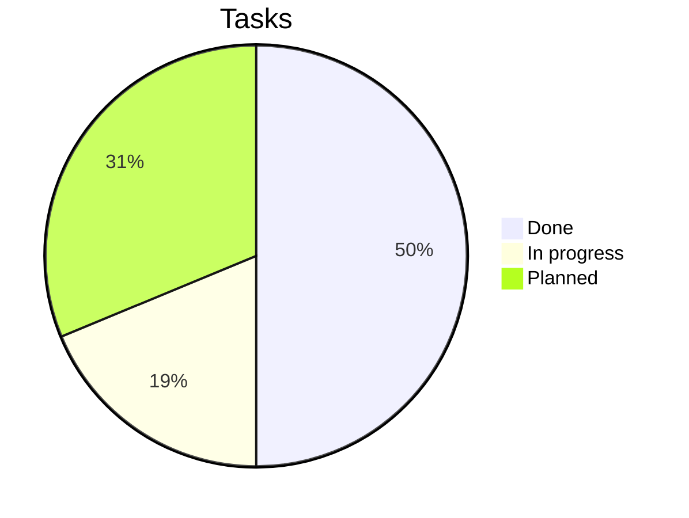

# Mermaid diagrams

Use a fenced code block with the language `mermaid` to render a diagram in the
preview. Diagrams work offline, follow the preview's light or dark appearance,
and are included in HTML exports, PDFs, and printed documents. Invalid diagrams
show an error above their source so you can correct the syntax.

## Flowchart

## Sequence diagram

## Pie chart

Other built-in Mermaid diagram types use the same fence syntax. See the
[Mermaid syntax reference](https://mermaid.js.org/intro/syntax-reference.html).
Diagram scripts and callbacks are disabled.
