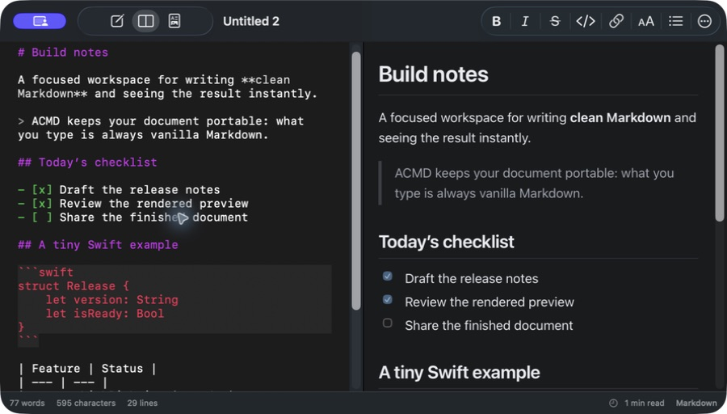
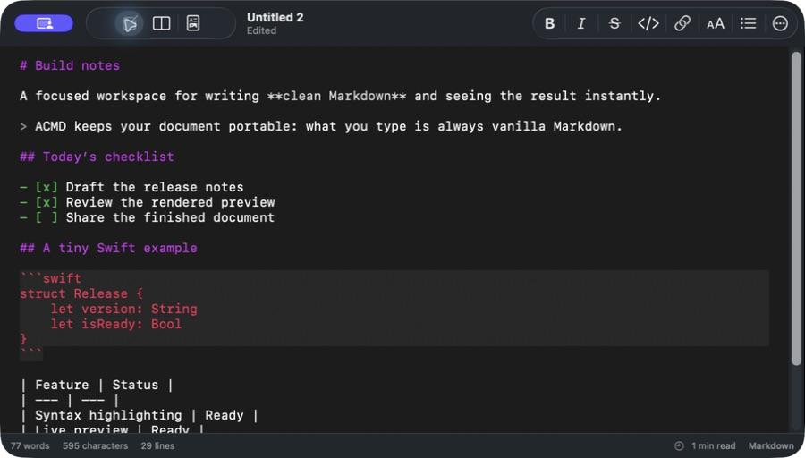
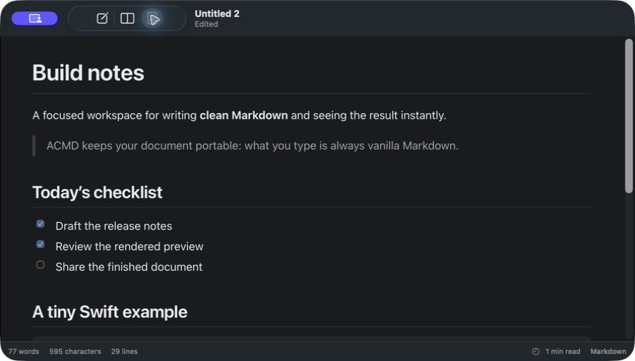

# ACMD

ACMD is a native macOS Markdown editor and renderer built with SwiftUI, AppKit, and WebKit. Its Markdown formatter, syntax tokenizer, parser, and HTML renderer are implemented in this repository; it has no third-party dependencies.

## Download

[Download the latest release](https://github.com/arcorley/acmd/releases/latest), open the disk image, and drag ACMD into Applications.

## Features

- Plain UTF-8 `.md` and `.markdown` documents with native open, Save As, autosave, undo, and redo
- Portable HTML export with embedded local images, PDF export, and native printing
- Line-numbered, zoomable `NSTextView` editor with optional wrapping, spellcheck, smart list continuation and indentation, and nested syntax highlighting
- Selection-aware Bold, Italic, Strikethrough, Inline Code, Link, Image, Heading, List, Quote, Code Block, and Horizontal Rule commands
- Editor, split, and rendered-preview layouts with native find in either pane
- Rendered headings, inline styles, links, images, block quotes, lists, task lists, fenced code, tables, and horizontal rules
- Dynamic light/dark appearance, selectable preview text, relative image/link resolution, and native accessibility labels
- Word, character, line, selection, cursor-position, and estimated reading-time statistics







## Build from source

Requirements: macOS 14 or newer and Xcode 15.3 or newer.

```sh
git clone https://github.com/arcorley/acmd.git
cd acmd
make test
make app
open .build/ACMD.app
```

For development, open `Package.swift` in Xcode or run `make run` from the repository root.

## Shortcuts

| Action | Shortcut |
| --- | --- |
| Save As | Shift-Command-S |
| Print rendered document | Command-P |
| Find in focused pane | Command-F |
| Find and replace | Option-Command-F |
| Find next | Command-G |
| Find previous | Command-Shift-G |
| Go to line | Command-L |
| Indent list items | Tab |
| Outdent list items | Shift-Tab |
| Increase editor text size | Command-+ |
| Decrease editor text size | Command-- |
| Reset editor text size | Command-0 |
| Bold | Command-B |
| Italic | Command-I |
| Strikethrough | Command-Shift-X |
| Inline code | Control-Command-C |
| Link | Command-K |
| Toggle rendered preview | Command-Shift-V |
| Editor only | Control-Command-1 |
| Split view | Control-Command-2 |
| Preview only | Control-Command-3 |

All document content remains vanilla Markdown. Editor colors and font traits are temporary display attributes and are never written into the file.
